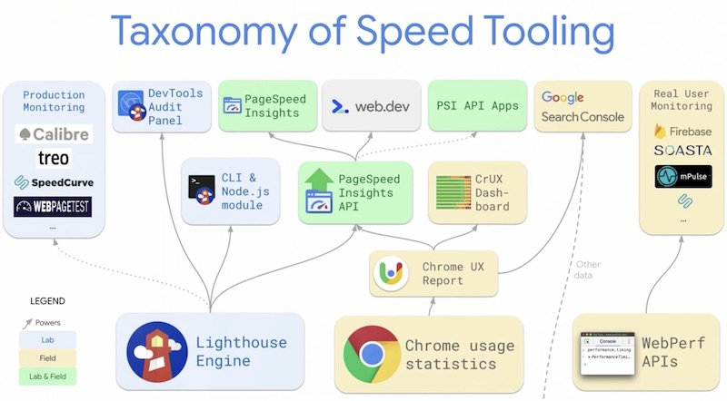
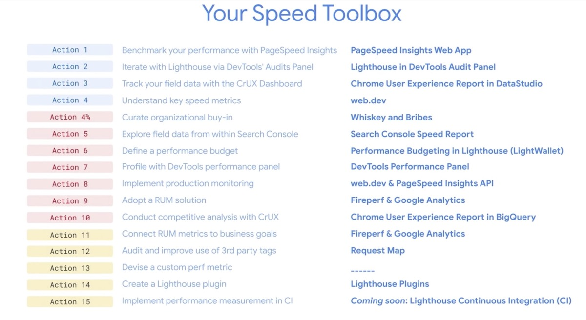

# Demystifying Speed Tooling (Google I/O ’19)

https://www.youtube.com/watch?v=mLjxXPHuIJo

- [Fundamentals](#fundamentals)
  * [1. Benchmark with PageSpeed Insights](#1-benchmark-with-pagespeed-insights)
  * [2. Iterate with Lighthouse via the Devtools/Audits panel](#2-iterate-with-lighthouse-via-the-devtoolsaudits-panel)
  * [3. Track your field data with the CrUX Dashboard](#3-track-your-field-data-with-the-crux-dashboard)
  * [4. Understand key speed metrics](#4-understand-key-speed-metrics)
  * [Taxonomy of speed tooling](#taxonomy-of-speed-tooling)
  * [Curate organizational buy-in](#curate-organizational-buy-in)
- [Professional techniques](#professional-techniques)
  * [5. Explore field data from within the Search Console](#5-explore-field-data-from-within-the-search-console)
  * [6. Define a performance budget](#6-define-a-performance-budget)
  * [7. Profile with Devtools/Performance panel](#7-profile-with-devtoolsperformance-panel)
  * [8. Implement production monitoring](#8-implement-production-monitoring)
  * [9. Adopt a RUM solution](#9-adopt-a-rum-solution)
  * [10. Conduct competitive analytics with CrUX](#10-conduct-competitive-analytics-with-crux)
- [Robust regression defense](#robust-regression-defense)
  * [11. Connect RUM metrics with business goals](#11-connect-rum-metrics-with-business-goals)
  * [12. Audit and improve use of 3rd party tags](#12-audit-and-improve-use-of-3rd-party-tags)
  * [13. Devise custom performance metrics](#13-devise-custom-performance-metrics)
  * [14. Create a Lighthouse plugin](#14-create-a-lighthouse-plugin)
  * [15. Implement performane measurement in CI](#15-implement-performane-measurement-in-ci)
- [Summary](#summary)

## Fundamentals

### 1. Benchmark with PageSpeed Insights

* still the best starting point for everyone

### 2. Iterate with Lighthouse via the Devtools/Audits panel

* now with stack packs - tailored advice to your stack (e.g. Wordpress)

### 3. Track your field data with the CrUX Dashboard

* Google Data Studio report built on CrUX data

### 4. Understand key speed metrics

FCP, FID, TTI + new metrics in development:

* layout stability: https://gist.github.com/skobes/2f296da1b0a88cc785a4bf10a42bca07 (origin trial, too)
* largest contentful paint

### Taxonomy of speed tooling

### Curate organizational buy-in

Make the business realize the conversion impact and how performance is a feature.

## Professional techniques

### 5. Explore field data from within the Search Console 

### 6. Define a performance budget

Now within Lighthouse:

* Docs - https://developers.google.com/web/tools/lighthouse/audits/budgets
* Budget calculator - https://perf-budget-calculator.firebaseapp.com/

### 7. Profile with Devtools/Performance panel

* Devtools > Performance Docs - https://developers.google.com/web/tools/chrome-devtools/evaluate-performance/

### 8. Implement production monitoring

Lab/synthetic checks on production

* Calibre, Treo, Speedcurve
* web.dev/measure
* PSI API - https://developers.google.com/speed/docs/insights/v5/get-started

### 9. Adopt a RUM solution

Collect field data from your users

* Firebase has this built-in

### 10. Conduct competitive analytics with CrUX

* build yourself using CrUX Cookbook: https://github.com/GoogleChrome/CrUX

My 2c: you can also try Akamai's comparison tool built on CrUX data: https://developer.akamai.com/akamai-mpulse/crux-benchmarking

## Robust regression defense

### 11. Connect RUM metrics with business goals

* choose representative pages and correlate over time

### 12. Audit and improve use of 3rd party tags

* requestmap.webperf.tools
* patrickhulce/thirdparty-web

My 2c: tracking network requests + size is cool but should also look at CPU time spent on Main Thread (see https://speedcurve.com/blog/third-party-blame-game/)

### 13. Devise custom performance metrics

* KPIs specific to your site
* e.g. Element timing - https://developers.chrome.com/origintrials/#/view_trial/3954160472831295489 (origin trial)

### 14. Create a Lighthouse plugin

* Handbook: https://github.com/GoogleChrome/lighthouse/blob/master/docs/plugins.md

My 2c: finally easily shareable as npm module (unlike the old custom audits)

### 15. Implement performane measurement in CI

* especially if for all PRs
* LightHouse CI coming soon...

My 2c: Do they mean https://github.com/GoogleChromeLabs/lighthousebot?

## Summary

