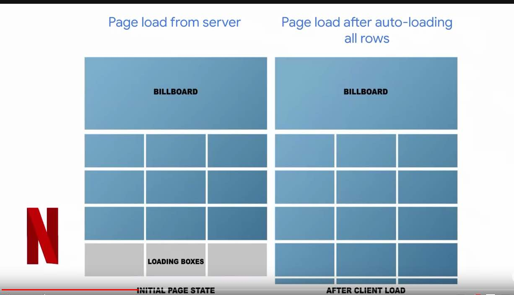
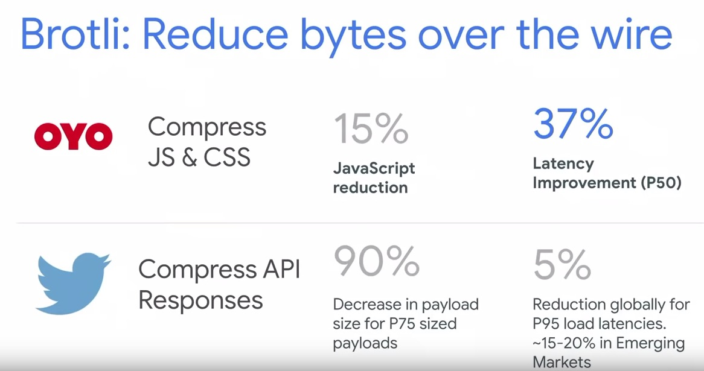
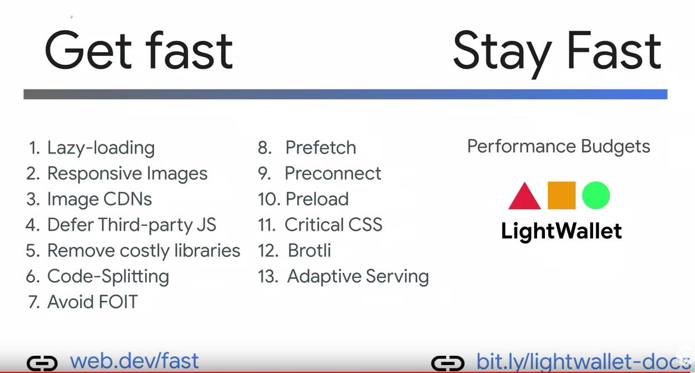

# Speed at Scale: Web Performance Tips and Tricks from the Trenches

https://www.youtube.com/watch?v=YJGCZCaIZkQ

## Performance Budgets

Based on:
time: < 2 s TTI
resourses: < 150Kb Js
lighthouse: 90+ Perf score

### LightWallet

Performance budget tooling for lighthouse (or Command line version of lighthouse)
https://developers.google.com/web/tools/lighthouse/audits/budgets

### Perfomance Budget Calculator

https://perf-budget-calculator.firebaseapp.com/
it can generate the budget.json for you, has a TTI range

## Lazyload

### lazyload images

- Use an SVG placeholder with image dimensions to avoid reflow
- google is levereging *Intersection Observer* for images

Netflix

Lazyload on vertical scroll :)

### Chrome 75 Lazyload Natively

https://addyosmani.com/blog/lazy-loading/?q=io

Chrome 75 (summer)
Eager loading: <iframe loading="eager">
Lazy Loading: 

chrome://flags/#enable-lazy-frame-loading

### Responsive images

Twitter limits pixel density on images to 2x (retina) - human eye cannot see more

## Javascript

TOKOPEDIA 
- serves a "lite" version of their app to new users
- Lite Version uses Svelte: service workers precache their react app in the background (WOW)

### 3rd Party

57% of execution time in average

- defer 3rd party js

### Code spliting

- lazyload on demand

### PRPL Pattern

Jabong:
Push minimal code to get interactive:
1. HTML CSS JS
2. Render fast
3. Precache other routes (SW)
4. Lazy-load JS On demand

## Fonts

font-display: swap

## Critical CSS

- inline critical CSS: deliver document in <= 14Kb
https://github.com/addyosmani/critical
- impact in FCP, careful if it is too much

### ESI - Edge Side Inclusion

Markup language for assembling documents; CDN feature
<esi:include src="/critical.css?service=article">

## Compression

Brotli

- companies are using on static assets

## Adaptive Service

navigator.connection.effectiveType
navigator.connection.saveData

twitter 80% reduction on data-usage from images on web

Ebay:
On a fast connection, features like product zooming will load on demand. On slow connections, they won't.

